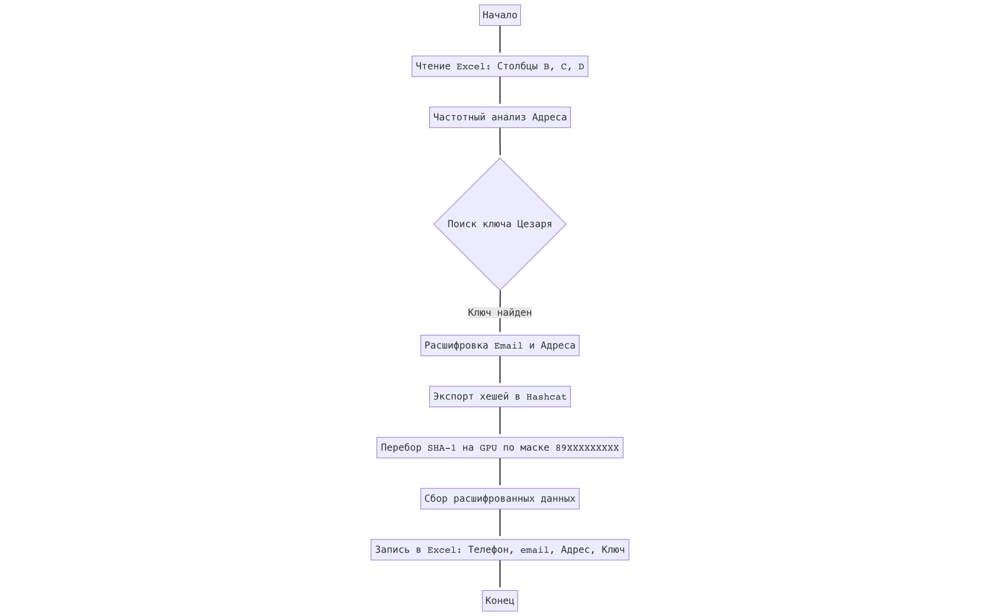

# Task_3

### Блок схама


### Нужные утилиты
```
hashcat
```

### Нужные пакеты
```
pandas openpyxl
```

### Способ запуска
```
python3 dedepersonalization.py -i Задание-3-данные.xlsx -o results.xlsx
```

### Ход решения

Для начала было сделано несколько наблюдений: алгоритм вероятно сохраняет длины слов в почте и адресе, так как позиции спецсимволов (@, .) были классические для email и топонимов (ул., кв., д.) и паттерны до и после них были похожи на email и адрес, только с замененными буквами. Это однозначно указало на использование шифра Цезаря, где каждый символ смещен на фиксированное число позиций по алфавиту, спецсимволы же не меняются. Предположение было проверено и подтверждено. Оказалось, так же, что почта и адрес смещены на одинаковое количество символов.
Далее, было сделано предположение, что для защиты номера телефона была использована необратимая функция хеширования SHA-1, что было определено по характерной длине строки в 40 шестнадцатеричных символов (160 бит). Далее после перебора масок 79XXXXXXXXX, +79XXXXXXXXX, 9XXXXXXXXX, 89XXXXXXXXX (перебор всех 11-12 или более символов будет в сотни раз дольше, так что имеет смысл по-подбирать возможные маски) брутфорсом было определено, что формат номеров начинается с 89XXXXXXXXX и не зависит от ключа шифрования (было предположение, что смещение в цезаре оно же соль для хеша), то есть HMAC не применялся.

### Описание реализованного решения

Лингвистический анализ: Скрипт перебирает все возможные сдвиги (0–32) для кириллического адреса и ищет вхождения общепринятых сокращений (ул., д., кв.). Сдвиг, дающий наибольшее количество совпадений, признается истинным ключом.

Деобфускация текста: С найденным ключом восстанавливаются исходные значения Email и Адреса.

Брутфорс хешей: Программа формирует список хешей и передает их утилите Hashcat, которая, выполняет перебор по маске мобильных номеров РФ (89XXXXXXXXX).

Форматирование: Данные собираются в финальный отчет Excel.